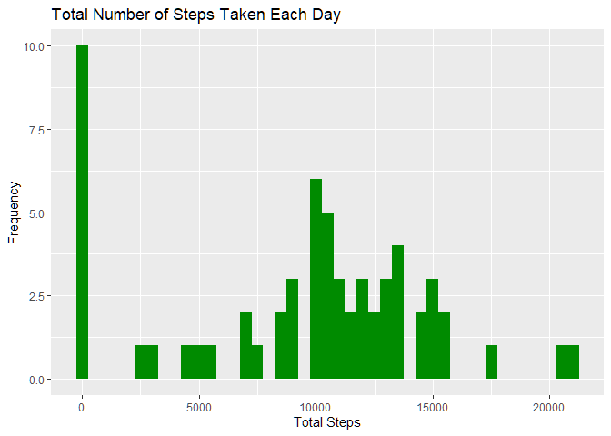
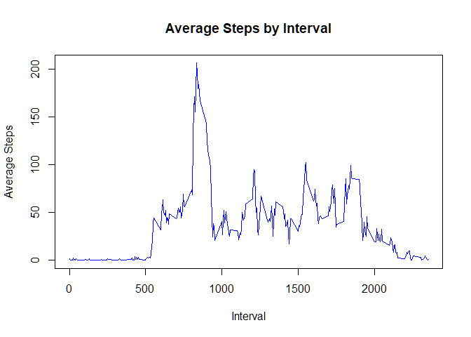
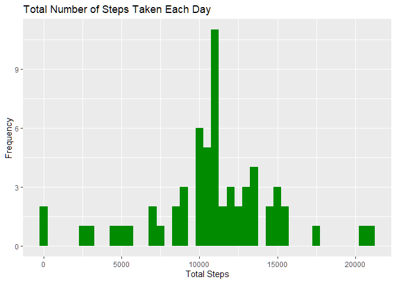
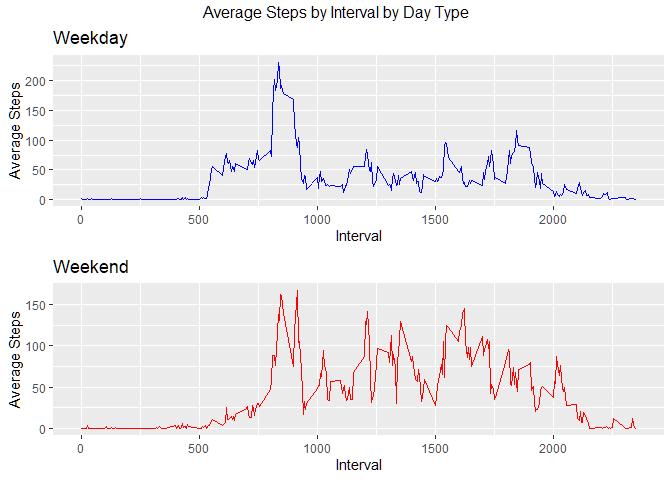

## Loading and preprocessing the data

**1. Code for reading in the dataset and/or processing the data:**

Load libraries:


```r
library(ggplot2)
library(dplyr)
library(gridExtra)
```

Load datafile. Then, change date data to date variable type:


```r
activities <- read.csv(file = "activity.csv", sep = ",")
activities$date <- as.Date(activities$date, format = "%Y-%m-%d")
```

## What is mean total number of steps taken per day?
Calculate total steps for each day:


```r
stepsByDate <- data.frame(date = unique(activities$date), totalSteps = 
                              tapply(activities$steps, activities$date, sum, 
                                     na.rm=TRUE), row.names = NULL)
```

**2. Histogram of the total number of steps taken each day:**

Plot a histogram of the total steps for each day:


```r
ggplot(stepsByDate, aes(x = totalSteps)) + 
           geom_histogram( binwidth = 500, fill = "green4") +
           labs( title = "Total Number of Steps Taken Each Day", x = 
                     "Total Steps" , y = "Frequency")
```

<!-- -->

**3. Mean and median number of the total steps taken each day**

Calculate and display the mean and median:


```r
meanStepsByDate <- mean(stepsByDate$totalSteps)
medianStepsByDate <- median(stepsByDate$totalSteps)
```

```r
meanStepsByDate
```

```
## [1] 9354.23
```

```r
medianStepsByDate
```

```
## [1] 10395
```

## What is the average daily activity pattern?

**Calculate average steps for each day**


```r
avgByInterval <- data.frame(interval = unique(activities$interval), 
    avgSteps = tapply(activities$step, activities$interval, mean, na.rm = TRUE, 
                      row.names = NULL))
```

**4. Time series plot of the average number of steps taken**

Plot the average number of steps taken each day:


```r
plot(x = avgByInterval$interval, y = avgByInterval$avgSteps, type = "l", 
     col = "blue", main = "Average Steps by Interval", xlab = "Interval",
     ylab = "Average Steps")
```

<!-- -->

**5. The 5-minute interval that, on average, contains the maximum number of steps**

Calculate the maximum average number of steps taxen each day:

``{r}
filter(avgByInterval, avgByInterval$avgSteps == max(avgByInterval$avgSteps))
```

## Imputing missing values
Calculate and report the total number of missing values in the dataset:


```r
sum(is.na(activities$steps))
```

```
## [1] 2304
```

```r
sum(is.na(activities$date))
```

```
## [1] 0
```

```r
sum(is.na(activities$interval))
```

```
## [1] 0
```

**6. Code to describe and show a strategy for imputing missing data**

Replace NA activities$steps data with average steps for that interval.


```r
activities2 <- activities
naSteps <- is.na(activities2$steps)
```


```r
while(sum(naSteps) > 0 ){
activities2[naSteps,]$steps <- avgByInterval[activities2[naSteps,]$interval == 
                                        avgByInterval$interval,]$avgSteps
naSteps <- is.na(activities2$steps)
}
```

**7. Histogram of the total number of steps taken each day after missing values** 
**are replaced with average steps at miss data's interval**
**Code to find the average number of steps**


```r
stepsByDate2 <- data.frame(date = unique(activities2$date), totalSteps = 
                              tapply(activities2$steps, activities2$date, sum, 
                                     na.rm=TRUE), row.names = NULL)
```

Plot of average number of steps taken each day with the missing data replaced
with average number at the missing data's interval:


```r
ggplot(stepsByDate2, aes(x = totalSteps)) + 
    geom_histogram( binwidth = 500, fill = "green4") +
    labs( title = "Total Number of Steps Taken Each Day", x = 
              "Total Steps" , y = "Frequency")
```

<!-- -->

Caclculate and display mean and median of new data with missing values replaced:


```r
meanStepsByDate2 <- mean(stepsByDate2$totalSteps)
medianStepsByDate2 <- median(stepsByDate2$totalSteps)
```


```r
meanStepsByDate2
```

```
## [1] 10766.19
```

```r
medianStepsByDate2
```

```
## [1] 10766.19
```

The original mean is 9354.23, and the new mean is 10766.19. The orignal median
is 10395, and the new median is 10766.19. The new results differ from the old
results.


## Are there differences in activity patterns between weekdays and weekends?

**8. Panel plot comparing the average number of steps taken per 5-minute**
**interval across weekdays and weekends**


Make copy of data to a new data frame. Then, add a new column based on weekday
or weekend day type:


```r
activities3 <-activities2
activities3 <- mutate(activities3, daytype = ifelse(weekdays(activities3$date) 
                            %in% c("Saturday", "Sunday"), "weekend", "weekday"))
activities3$daytype <- as.factor(activities3$daytype)
```

Calculate average steps taken each day based on day type:


```r
avgByInterval2 <- data.frame(interval = unique(activities3$interval), 
                        avgSteps = tapply(activities3$step, 
                        list(activities3$interval, activities3$daytype) , mean, 
                        row.names = NULL))
```

Plot two plots with average steps taken at each interval. One plot for weekdays 
and one plot for weekends:


```r
p1 <- ggplot(avgByInterval2, aes(x = interval, y = avgSteps.weekday)) + 
            geom_line(col = "blue") +
            labs(title = "Weekday", x = "Interval", y = "Average Steps")
            

p2 <- ggplot(avgByInterval2, aes(x = interval, y = avgSteps.weekend)) + 
            geom_line(col = "red") +
            labs(title = "Weekend", x = "Interval", y = "Average Steps")
```

Display the two new plots:


```r
grid.arrange(p1, p2, top = "Average Steps by Interval by Day Type")
```

<!-- -->


